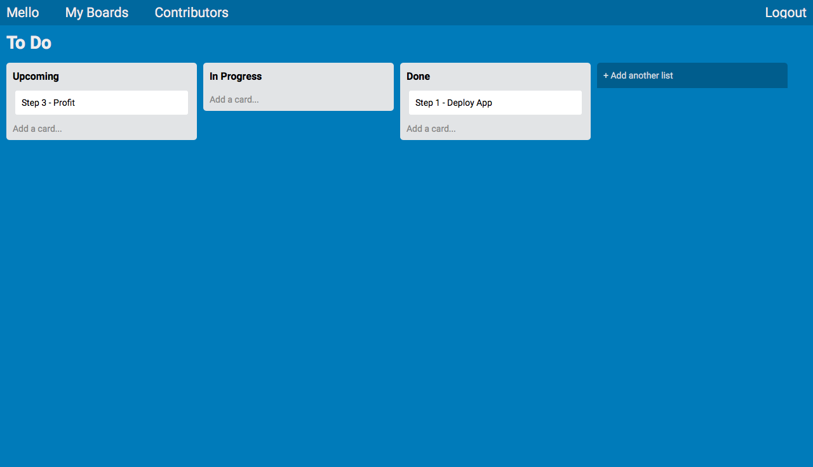

# Mello

A Trello clone which dislays a Kanban style to do list. Mello gives the ability to sign up for an account, create and manage boards, and invite other users to contribute to boards.

## Built With

* Javascript frontend
* Rails API

## Gems

* [Devise](https://github.com/heartcombo/devise) - User management and authentication

## Acknowledgments

* [The Firehose Project](https://thefirehoseproject.com)
